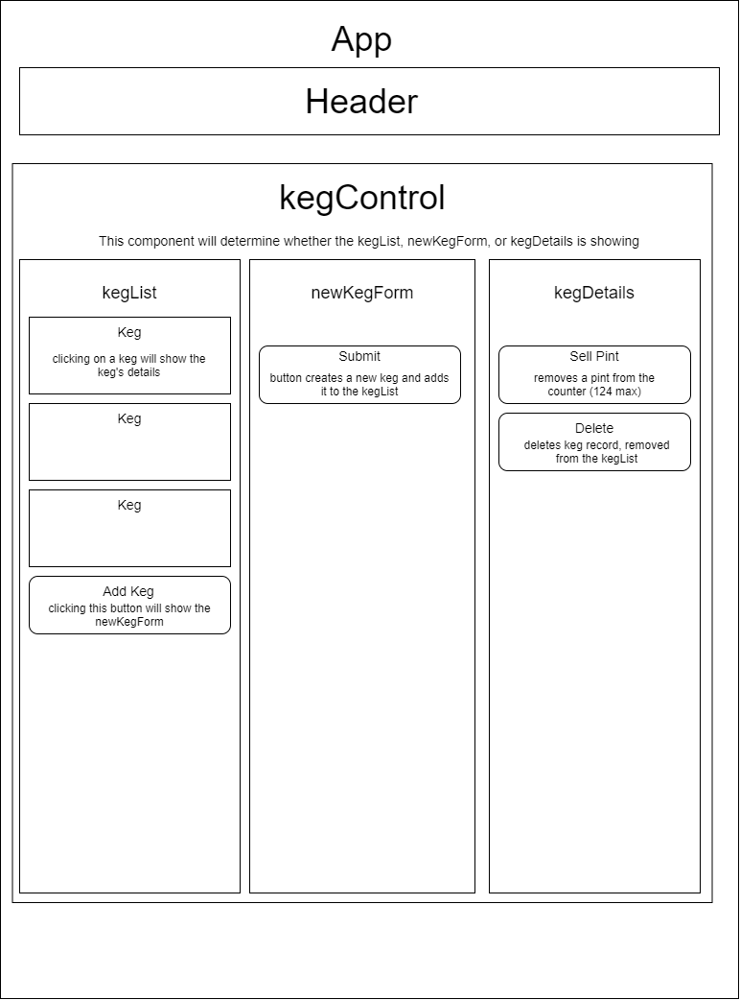

<h1 align="center"><strong>Pierre's Tap Room</strong></h1>

<h4 align="center"><em>React app that allows the creation and deletion of keg records as well as pint's remaining tracker.</em></h4>

##### __Created:__ 9/18/2020
##### __Last Updated:__ 9/21/2020 
##### By _**Tyson Lackey**_  

## Description

This react app is built based on the following diagram. Users are able to add new keg records and details which are displayed in a list. List items can be selected which display the keg details where they can be deleted, or pints can be sold. If pints reach 0, they will stop decrimenting and remain empty.

## Setup/Installation Requirements

##### &nbsp;&nbsp;&nbsp;&nbsp;&nbsp;&nbsp;Open via Bash/GitBash:

1. Clone this repository onto your computer:
    "git clone https://github.com/Lackeyt/TapRoom"
2. Navigate into the "TapRoom" directory in Visual Studio Code or preferred text editor:
3. Open the project by typing "code ." while in the previous directory in your terminal.
4. Open your computer's terminal and navigate to the directory bearing the name of the program and containing the top level subdirectories and files.
5. Enter the command "dotnet build" in the terminal and press "Enter".
6. Enter the command "dotnet watch run" in the terminal and press "Enter".

This project was bootstrapped with [Create React App](https://github.com/facebook/create-react-app).

## Known Bugs

* When pints are decrimented on a keg, it moves to the bottom of the keg list

## Support and contact details

* Discord: TysonL#4409
* Email: lackeyt90@gmail.com

## Technologies Used

* Visual Studio Code
* HTML
* CSS
* Bootstrap
* React

### License

Copyright (c) 2020 **_Tyson Lackey_**

This software is licensed under the MIT license.

